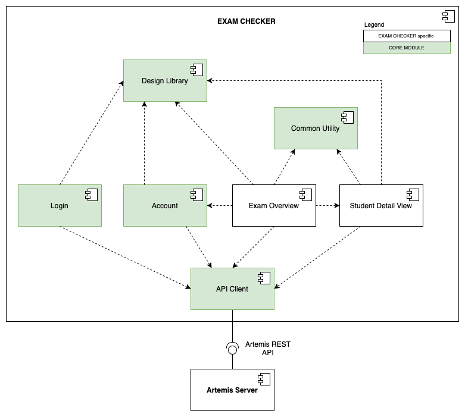

# Artemis Exam Checker

The Artemis Exam Participation Checker iPad application (in short: `Exam Checker`) is designed to streamline the process of checking student attendance during onsite exams conducted with the Artemis platform.
The application replaces the traditional paper-based method with a digitalized process, making tracking and managing student attendance easier.
The application includes features such as student identification, digital signing, and attendance tracking.
The Artemis web platform was adapted to support additional exam management tasks, such as uploading the seating arrangement and images for students.

## Architecture

The `Exam Checker` primarily comprises two screens: the *Exam Overview* and the *Student Detail View*.
Each view utilizes the *Design Library* for shared UI components and employs the *Common Utility* for additional utility functionalities such as date formatting.

Eeach UI-related subsystem is associated with a dedicated service.
These services use the shared *API Client* for network communication with the server.
Additional components are employed for user handling, including the *Login* subsystem for handling the authentication process and the *Account* subsystem for account management functionalities.

For the sake of simplicity, the referenced figure (`exam-checker-subsystem`) does not show all `Core Module` subsystems. Therefore the *User Session Store*, *Artemis Profile Info*, and *Shared Models* subsystems are not shown in the figure. However, `Exam Checker` also uses these subsystems. More information about the `Core Module` can be found [here](https://github.com/ls1intum/artemis-ios-core-modules/blob/main/README.md)

*Figure: Subsystem decomposition of the `Exam Checker` application.*